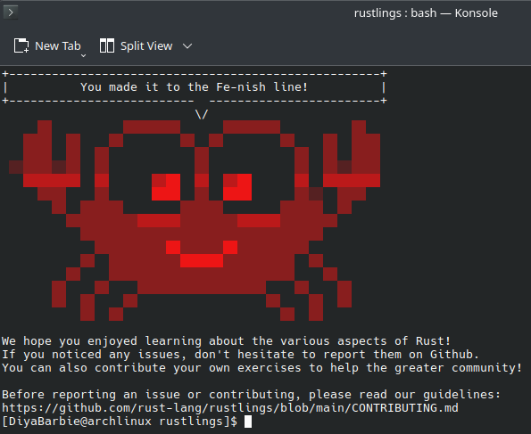

# Rustlings Solutions

This repository contains my solutions to the Rustlings exercises, completed while learning Rust alongside *The Rust Programming Language* (Rust Book).

All solutions are written in the **original Rustlings exercise files**. You can find them inside the `exercises/` folder.

## 📸 Progress
  
<!-- Replace `completion.png` with your actual image filename -->

In addition to the Rustlings exercises, this repository also includes the final project from the Rust Book — **Building a Multi-Threaded Web Server** — located at `my-rustlings/threadpool/`.

## Final Project Highlights

We built a basic web server that uses a **thread pool** to handle incoming requests asynchronously.  
The server also supports **graceful shutdown**, ensuring all worker threads are cleaned up properly before exit.

## 📚 Sources
- [Rustlings](https://github.com/rust-lang/rustlings)
- [The Rust Programming Language](https://doc.rust-lang.org/book/)

---

Feel free to explore the exercises or use them for reference while learning Rust.
